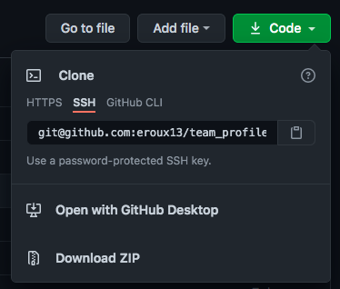
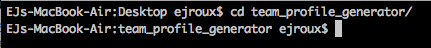
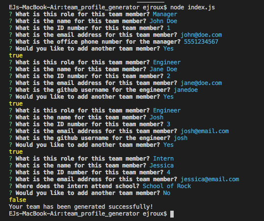
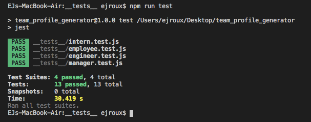
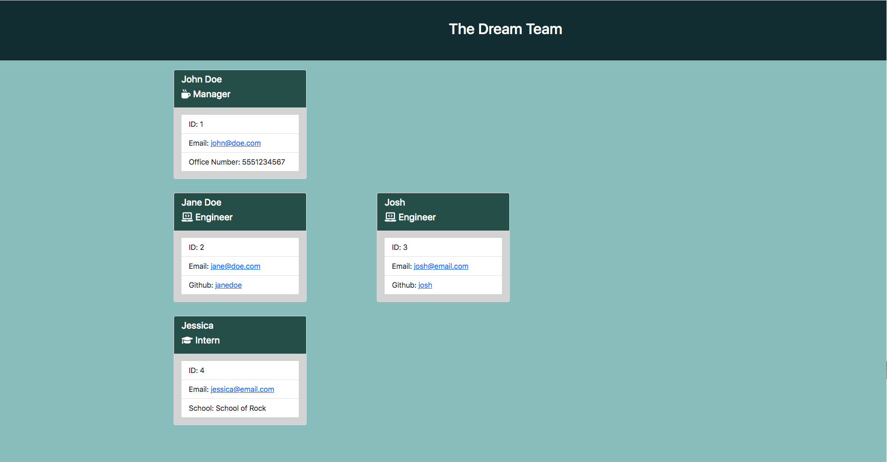

# Team Profile Generator

## Description

The purpose of this project is to build a Node.js command-line application that takes in information about employees on a software engineering team, then generate an HTML webpage that displays summaries for each person. This project also features the use of testing through Node.js's built in package called [Jest](https://www.npmjs.com/package/jest). To take user input the project also features the use of the [Inquirer](https://www.npmjs.com/package/inquirer) package.

[Full Video Walkthrough](https://drive.google.com/file/d/1EPW-A2-1N119oGlMCxswRAktQDCHlEcI/view)

## Table of Contents

* [Description](#description)
* [License](#license)
* [Installation](#installation)
* [Usage](#usage)
* [Contributors](#contributors)
* [Tests](#tests)
* [Questions](#questions)
    
## License

License chosen: MIT.
More information about the license chosen can be found on [Open Source Initiative](https://opensource.org/licenses/MIT).
    
## Installation

To install this project, the user needs to clone the repository to their local machine. 

Next the user needs to navigate into the directory on their machine using either Terminal or Git Bash depending on the user's OS. The user could also use the integrated command-line in VS Code. 

Once in the directory, the user needs to input `node index.js` to run the application.

## Usage

The usage of this project is to have a visual representation of a team, where access to neccessary information is easily accessible. This project can also save time from hard-coding an HTML page through the usage of auto generating one from user input.

## Contributors

[eroux13](https://www.github.com/eroux13)

## Tests

To test this project, the user can input and run `npm run test`. This will use [Jest](https://www.npmjs.com/package/jest) package and use the test scripts in the tests directory to make sure that the classes and functions are returning the proper values.

## Questions

Feel free to follow my GitHub [profile](https://www.github.com/eroux13).
If you have any questions about this project, please reach out to me via ej.roux13@gmail.com.

## Generated Sample

